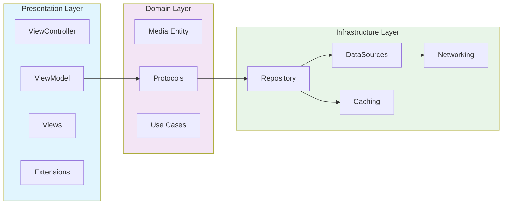
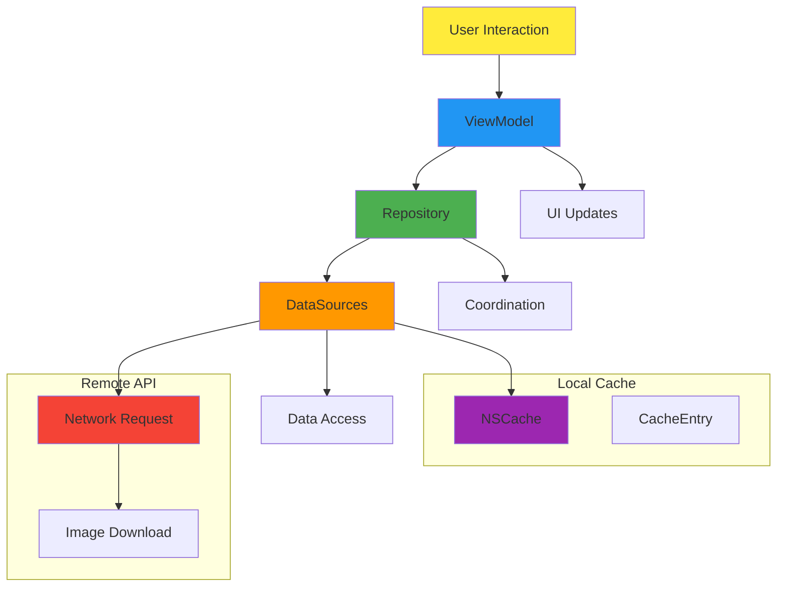
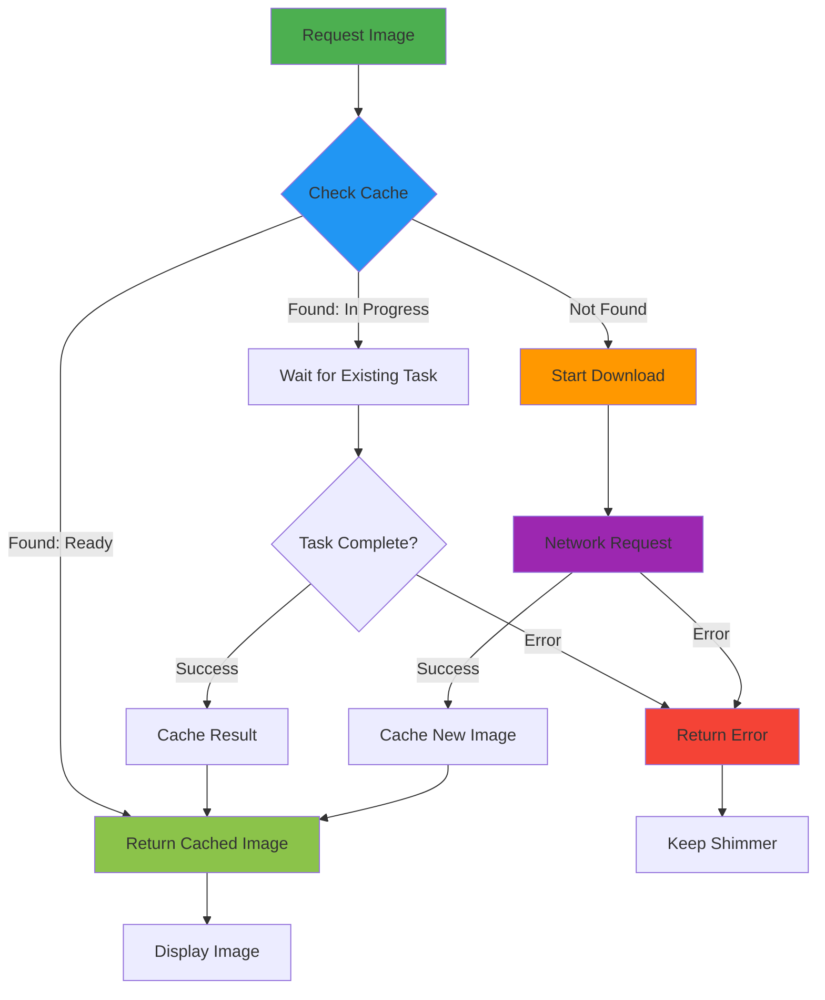

# Image Gallery

A modern iOS image gallery application showcasing advanced UIKit techniques, clean architecture patterns, and performance optimizations.

## 📱 Overview

This Image Gallery demonstrates a production-ready implementation of a high-performance image browsing experience, similar to apps like Instagram, Pinterest, or Apple Photos. The app efficiently handles large image collections with smooth scrolling, intelligent caching, and modern loading states.

## ✨ Core Features

### 🚀 Performance Optimizations
- **Local Caching** - Intelligent NSCache implementation with memory management
- **Prefetching** - Downloads images before cells become visible using `UICollectionViewDataSourcePrefetching`
- **Cell Reuse Optimization** - Proper lifecycle management preventing visual artifacts
- **Smart Loading States** - Shimmer effects during image loading with smooth transitions

### 🎨 Modern UI/UX
- **Diffable Data Sources** - `UICollectionViewDiffableDataSource` for smooth, animated updates
- **Compositional Layout** - Different layouts for pinned and recent sections
- **Custom Shimmer Effect** - Adaptive loading animation that scales to different cell sizes
- **Responsive Design** - Works seamlessly across all screen sizes and orientations

### 🏗️ Clean Architecture
- **Repository Pattern** - Separation of data access concerns
- **MVVM Architecture** - Clear separation between UI and business logic
- **Dependency Injection** - Testable and maintainable code structure
- **Protocol-Oriented Design** - Flexible and mockable interfaces

### 🌐 Networking & Data
- **Async/Await** - Modern Swift concurrency for network operations
- **Request Deduplication** - Prevents multiple downloads of the same image
- **Error Handling** - Graceful degradation and retry mechanisms
- **Reactive Data Flow** - Combine framework for automatic UI updates

## 🏛️ Architecture



### Domain Layer
- **Entities**: Core business objects (`Media`, `MediaType`)
- **Repository Protocols**: Contracts for data access
- **Business Logic**: Pure domain logic without external dependencies

### Infrastructure Layer
- **Repository Implementation**: Coordinates between local and remote data sources
- **Data Sources**: Separate concerns for network and caching
- **URL Providers**: Configurable sources for image URLs (production vs. demo)

### Presentation Layer
- **ViewModels**: UI state management and user interaction handling
- **Views**: UIKit components with custom cells and layouts
- **Extensions**: Reusable UI enhancements (shimmer effects)

## 🎯 Technical Implementation

### Data Flow



### Caching Strategy



**Key Features:**
1. **Cache-First Approach** - Always check local cache before network
2. **In-Progress Tracking** - Share ongoing downloads between requests
3. **Memory Management** - Automatic eviction with configurable limits
4. **Smart Invalidation** - Proper cleanup during cell reuse

### Layout System
- **Pinned Section**: Horizontal scrolling cards (featured content)
- **Recents Section**: 3-column grid with efficient cell sizing
- **Section Headers**: Dynamic headers with proper spacing
- **Adaptive Sizing**: Responds to different screen sizes and orientations

## 🛠️ Key Technologies

### UIKit & Foundation
- `UICollectionViewCompositionalLayout` - Modern layout system
- `UICollectionViewDiffableDataSource` - Animated data updates
- `NSCache` - Intelligent memory caching
- `URLSession` - Network operations with async/await

### Swift Features
- **Async/Await** - Modern concurrency patterns
- **Combine** - Reactive programming for UI updates
- **Protocol-Oriented Programming** - Flexible architecture
- **Value Types** - Immutable data structures where appropriate

### Design Patterns
- **Repository Pattern** - Data access abstraction
- **MVVM** - Separation of UI and business logic
- **Dependency Injection** - Testable architecture
- **Observer Pattern** - Reactive UI updates

## 📊 Performance Characteristics

### Memory Management
- Smart cache with size limits (200 items, 100MB)
- Automatic cleanup during memory pressure
- Efficient cell reuse without memory leaks

### Network Efficiency
- Request deduplication prevents redundant downloads
- Intelligent prefetching based on scroll behavior
- Proper error handling and retry logic

### UI Responsiveness
- 60fps smooth scrolling even with large datasets
- Non-blocking image loading
- Immediate visual feedback with loading states

## 🧪 Testing Strategy

### Unit Tests
- Repository logic testing with mocked data sources
- ViewModel behavior testing
- Network layer testing with mock URLSession

### Integration Tests
- End-to-end data flow testing
- Cache behavior verification
- Error handling scenarios

### UI Tests
- Collection view interaction testing
- Loading state verification
- Performance testing

## 🚀 Getting Started

### Prerequisites
- iOS 15.0+
- Xcode 14.0+
- Swift 5.7+

### Installation
1. Clone the repository
2. Open `ImageGallery.xcodeproj` in Xcode
3. Build and run on your preferred simulator or device

### Configuration
The app automatically uses demo URLs in DEBUG builds and can be configured for production URLs in RELEASE builds.

## 📋 Project Structure

```mermaid
graph TD
    IG[ImageGallery] --> APP[Application]
    IG --> DOM[Domain]
    IG --> INF[Infrastructure]
    IG --> PRES[Presentation]
    
    APP --> IGA[ImageGalleryApp.swift]
    
    DOM --> ENT[Entities]
    DOM --> PROT[Protocols]
    ENT --> MED[Media.swift]
    
    INF --> DS[DataSource]
    INF --> REP[Repository]
    INF --> CACHE[Caching]
    
    DS --> URLP[MediaURLProvider.swift]
    DS --> RDS[MediaRemoteDataSource.swift]
    DS --> LDS[MediaLocalDataSource.swift]
    
    REP --> MR[MediaRepository.swift]
    
    CACHE --> CE[CacheEntry.swift]
    CACHE --> NSC[NSCache+Subscript.swift]
    
    PRES --> VM[ViewModel]
    PRES --> VIEWS[Views]
    PRES --> EXT[Extensions]
    
    VM --> IGVM[ImageGalleryViewModel.swift]
    
    VIEWS --> IGVC[ImageGalleryViewController.swift]
    VIEWS --> IGC[ImageGalleryCell.swift]
    VIEWS --> IGF[ImageGalleryFactory.swift]
    
    EXT --> UVS[UIView+Shimmer.swift]
    
    style APP fill:#ffeb3b
    style DOM fill:#f3e5f5
    style INF fill:#e8f5e8
    style PRES fill:#e1f5fe
    style DS fill:#fff3e0
    style REP fill:#fff3e0
    style CACHE fill:#fff3e0
```



### File Structure (Text View)
```
ImageGallery/
├── Application/
│   └── ImageGalleryApp.swift          # App entry point
├── Domain/
│   ├── Entities/
│   │   └── Media.swift                # Core business entity
│   └── Protocols/                     # Repository contracts
├── Infrastructure/
│   ├── DataSource/
│   │   ├── MediaURLProvider.swift     # URL source abstraction
│   │   ├── MediaRemoteDataSource.swift # Network operations
│   │   ├── MediaLocalDataSource.swift # Caching operations
│   │   └── RetryConfiguration.swift   # Retry policy configuration
│   ├── Repository/
│   │   └── MediaRepository.swift      # Data coordination
│   └── Caching/
│       ├── CacheEntry.swift           # Cache state management
│       └── NSCache+Subscript.swift    # Cache utilities
└── Presentation/
    ├── ViewModel/
    │   └── ImageGalleryViewModel.swift # UI state management
    ├── Views/
    │   ├── ImageGalleryViewController.swift
    │   ├── ImageGalleryCell.swift
    │   └── ImageGalleryFactory.swift
    └── Extensions/
        └── UIView+Shimmer.swift       # Loading animations
```

## 🔄 Future Enhancements

- [ ] Core Data integration for persistent storage
- [ ] Search and filtering capabilities
- [ ] Favorites and collections
- [ ] Photo editing features
- [ ] Share functionality
- [ ] Offline support
- [ ] Dark mode optimizations

## 📄 License

This project is available under the MIT License.

---

Built with ❤️ using modern iOS development practices and clean architecture principles.