# News Feed

A modern SwiftUI News Feed showcasing clean architecture, type-safe caching, and async/await-first networking.

## 📱 Overview

The News Feed demonstrates a production-ready social feed: browsing posts, viewing details, creating posts, and interacting (like/share). It emphasizes clean boundaries between Domain and Infrastructure, lightweight local view state, and robust networking primitives.

## ✨ Core Features

### 🚀 Performance & State
- **In-Memory Cache**: Type-erased, type-safe cache with `CacheState` and `CacheStateBox`
- **In-Progress Tracking**: Avoid duplicate fetches by sharing `Task` while loading
- **Optimistic Updates**: Like/unlike interaction updates UI immediately
- **Pull-to-Refresh**: Seamless reload in the feed

### 🎨 Modern SwiftUI UI/UX
- **NavigationStack** with typed routes
- **Local ViewState** per screen (no external ViewModels)
- **Form-based Create Post** with dynamic attachment rows
- **Adaptive Loading/Empty/Error states** using system components

### 🏗️ Clean Architecture
- **Repository Pattern**: `PostRepository` coordinates remote/local/caching
- **Protocols**: `PostRepositoryFetching`, `PostRemoteDataFetching`, `PostLocalDataStoring`
- **DTO/DAO Separation**: Domain is decoupled from transport and persistence
- **Dependency Injection**: Views accept repository via initializer

### 🌐 Networking & Data
- **Async/Await** throughout networking and repository
- **HTTPClient** abstraction with `URLSessionHTTPClient`
- **RetryPolicy** with exponential backoff and jitter (via `Retrier` and policy)
- **SwiftData DAOs** for persistent models (PostDAO, PostDetailDAO, UserInteractionDAO)

## 🏛️ Architecture


### Domain Layer
- **Entities**: `PostPreview`, `PostDetail`, `AuthorPreview`, `UserInteraction`, `PostAttachement`
- **Pure Models**: No networking/persistence leakage

### Infrastructure Layer
- **Repository**: Orchestrates cache-first reads, merges remote/local, optimistic interactions
- **Data Sources**: Remote (network) and Local (SwiftData). DTOs/DAOs keep boundaries clean
- **Caching**: `EntryCache` + `CacheState` share in-progress tasks and cache ready values
- **Networking**: `HTTPClient` with interceptors, retry, and JSON encode/decode

### Presentation Layer (SwiftUI)
- **NewsFeedScreen**: Lists posts, pull-to-refresh, routes to create/detail
- **NewsFeedDetailScreen**: Loads post detail, supports like/unlike
- **CreatePostScreen**: Compose and publish a new post
- **Local ViewState**: Each screen holds its own `ViewState` struct

#### Interaction Naming Convention
- Interactions should describe the user's intent, not destinations.
- Prefer intent-based names like `postSelected(id:)` and `composeRequested` rather than `openDetail` or `openCreatePost`.
- Module routers are responsible for mapping intent → route (e.g., `postSelected(id:)` → `.detail(id)`).

#### Dependency Injection Pattern
- **Parent-to-Child**: Dependencies are passed down from parent to child views
- **No Self-Resolution**: Views should not resolve their own dependencies using `Container.shared.resolve()`
- **Explicit Dependencies**: All dependencies are explicitly declared in view initializers
- **Shared Instances**: Parent controls how instances are shared (singleton, per-view, etc.)
- **Testability**: Easy to inject mocks for testing

**Example:**
```swift
// ✅ Good: Parent passes dependency
struct ParentView: View {
    private let repository: PostRepositoryFetching
    
    var body: some View {
        ChildView(repository: repository)
    }
}

// ❌ Bad: Child resolves its own dependency
struct ChildView: View {
    private let repository = Container.shared.resolve(PostRepositoryFetching.self)
}
```

## 🎯 Technical Implementation

### Data Flow


### Caching Strategy

```mermaid
flowchart TD
    START[Request Post Detail] --> CACHE{Cache has entry?}
    CACHE -->|Ready| RETURN[Return cached]
    CACHE -->|In Progress| AWAIT[Await task]
    CACHE -->|Miss| READ[Read Local]
    READ -->|Found| CACHE_RDY[Cache ready]
    READ -->|Not Found| REMOTE[Fetch Remote]
    REMOTE --> CACHE_NEW[Cache in-progress → ready]
    CACHE_RDY --> RETURN
    CACHE_NEW --> RETURN

    style START fill:#4caf50
    style CACHE fill:#2196f3
    style RETURN fill:#8bc34a
    style REMOTE fill:#9c27b0
```



### Interaction Write Flow (Optimistic)


### Feed Read Flow (Overlay at Repository Boundary)


Notes:
- The repository overlays the minimal, locally-known interaction state onto server results. Views do not reconcile caches.
- Overlays are small deltas (liked, likesCount), not full `PostDetail` copies.
- When the backend confirms, overlays can be cleared or kept as recent truth.

## 🛠️ Key Technologies

- SwiftUI, NavigationStack, Form, List
- Swift Concurrency (async/await, Task)
- SwiftData for DAOs (PostDAO, PostDetailDAO, UserInteractionDAO)
- URLSession via `HTTPClient` abstraction
- Type-erased caching with `CacheStateBox`

## 🚀 Getting Started

### Prerequisites
- iOS 17+
- Xcode 15+

### Run
1. Open `News Feed.xcodeproj`
2. Build and Run the `News Feed` scheme

### Configure Networking
`URLSessionHTTPClient` is ready for injection via `HTTPClientConfig`. Replace stubbed remote/local data sources with real implementations and DTO mappings as needed.

## 📋 Project Structure (Module)

```
News Feed/
├── Application/
├── Domain/
├── Infrastructure/
│   ├── Repository/
│   ├── DataSource/
│   │   ├── DTO/
│   │   ├── DAO/
│   │   └── …
│   ├── Networking/
│   └── Caching/
└── View/
```

## 🔄 Future Enhancements

- [ ] Real remote endpoints wired via `HTTPClient`
- [ ] Full DAO <-> Domain mapping and persistence
- [ ] Pagination and infinite scrolling
- [ ] Media attachments rendering in feed/detail
- [ ] Offline mode and background sync for interactions
- [ ] Analytics and logging hooks

## 🧪 Testing

- Unit tests for `HTTPClient` and repository flows
- UI tests for feed loading, detail navigation, and create flow

